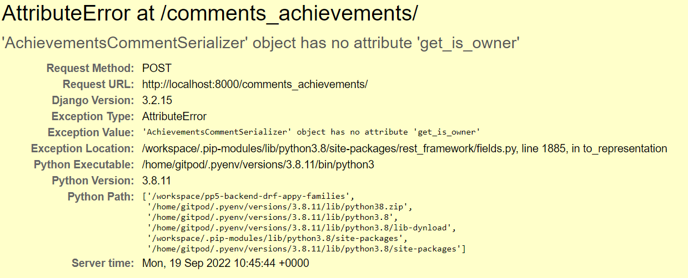

# Appy Families (backend)

# Table of Contents

1. [Introduction](#introduction)
2. [Database Schema](#database-schema)
3. [Testing](#testing)
4. [Bugs](#bugs)
    1. [fixed](#fixed)
    2. [Unfixed](#unfixed)
5. [Technologies Used](#technologies-used)
    1. [Languages](#languages)
    2. [Frameworks, libraries, and Programs](#frameworks-libraries-and-programs)
6. [Project Setup](#project-setup)
7. [Deployment](#deployment)
8. [Credits](#credits)
9. [Acknowledgements](#acknowledgements)

## Introduction

Appy Families is a website for use by the whole family, containing a memo page, todo list, and an achievements page. Instead of a whiteboard pinned to the fridge that no one ever reads why not use the app, most people walk about with mobile phones in their hand now, maybe your child may just complete a homework task, as they look cool to their friends.

This repository is the backend of the application using the Django REST Framework(DRF) holding the API database for the front end part of the application.

## Database Schema

[database schema for project](./assets/documents/erd-p5.png)

## Testing

- *Unit testing*, *Validator testing*, and *Manual testing* can all be found [here](/TESTING.md)

## Bugs
### fixed
- I had an Attribute error when trying to access the comments in the achievements part of the project.


- The problem was I had defined the function *get_owner* instead of *get_is_owner* in the serializers.py file of achievements, once this was changed the page loaded as expected.

- Whilst testing the Todo part of the application in unit testing, I kept getting failures for the tests for the due_date and urgent fields were not null, because I wasnt testing this part at the time I changed the field values in the database models to null for both fields, then migrated the database to allow for the changes, all tests then passed.

### Unfixed
- None known

## Technologies Used
### Languages

- Python - The Django REST Frameworks base language

### Frameworks, libraries, and Programs

- DrawSQL
    - for creating the erd diagram
- Django Cloudinary Storage 
    - storage of images
- Pillow 
    - image processing capabilities
- Git
    - For version control, committing and pushing to Github
- Github
    - For storing the repository, files and images pushed from Gitpod
- Gitpod
    - IDE used to code project
- Heroku
    - Used to deploy the application


## Project Setup

1. Use the Code Institutes full template to create a new repository, and open it in Gitpod.

2. Install Django by using the terminal command:
```
pip3 install 'django<4'
```
3. start the project using the terminal command:
```
django-admin startproject p5_drf_api . 
```
- The dot at the end initializes the project in the current directory.
4. Install the Cloudinary library using the terminal command:
```
pip install django-cloudinary-storage
```
5. Install the Pillow library for image processing capabilities using the terminal command:
``` 
pip install Pillow
```
- Pillow has a capital P.

6. Go to **settings.py** file to add the newly installed apps, the order is important
```
INSTALLED_APPS = [
    'django.contrib.admin',
    'django.contrib.auth',
    'django.contrib.contenttypes',
    'django.contrib.sessions',
    'django.contrib.messages',
    'cloudinary_storage', 
    'django.contrib.staticfiles',
    'cloudinary',
]
```
7. Create an **env.py** file in the top directory
8. In the **env.py** file and add the following for the cloudinary url:
```
import os
os.environ["CLOUDINARY_URL"] = "cloudinary://API KEY HERE"
```
9. In the **settings.py** file set up cloudinary credentials, define the media url and default file storage with the following code:
```
import os

if os.path.exists('env.py'):
    import env

CLOUDINARY_STORAGE = {
    'CLOUDINARY_URL': os.environ.get('CLOUDINARY_URL')
}
MEDIA_URL = '/media/'
DEFAULT_FILE_STORAGE = 'cloudinary_storage.storage.MediaCloudinaryStorage'
```

10. Workspace is now ready to use.

## Deployment

## Credits

## Acknowledgements