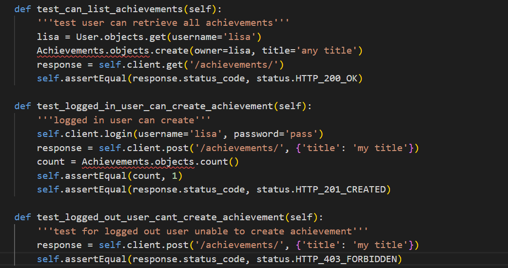
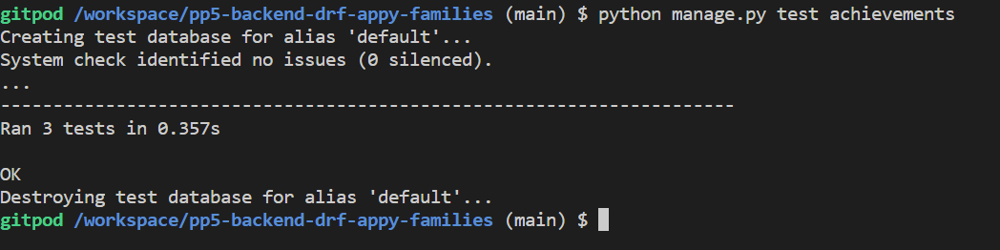
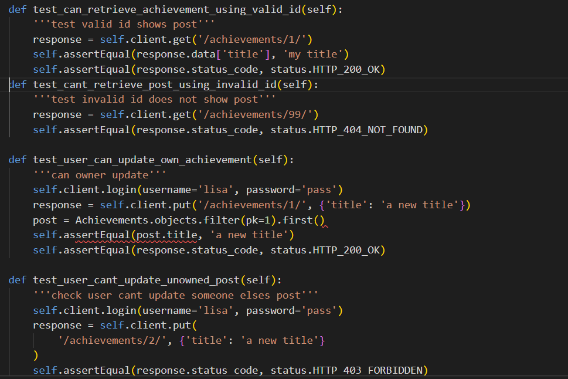
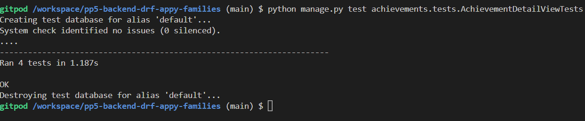

# Testing For Backend DRF-API-Appy-Families

## Contents
1. [Unit Testing](#unit-testing)
    1. [Achievements List View](#achievements-list-view)
    2. [Achievements Detail View](#achievements-detail-view)
    3. [Memo_posts List View](#memo_post-list-view)
    4. [Memo_posts Detail View](#memo_post-detail-view)
    5. [Todo List View](#todo-list-view)
    6. [Todo Detail View](#todo-detail-view)
2. [Validator Testing](#validator-testing)
3. [Manual Testing](#manual-testing)
    1. [URL Path tests](#url-path-tests)
    2. [Search and Filter testing](#search-and-filter-testing)
    3. [CRUD Testing](#crud-testing)

## Unit Testing
- I have used API Testcase to test the views using a red, green refactor method.
### Achievements List View
- Tests to make sure users can retrieve all achievements, a logged in user can update their
achievements, and a logged out user cannot create an achievement.

- results all passed

### Achievements Detail View
- Tests to check that a valid id will retrieve an achievement post, an invalid id will not retrieve an
achievement post, check wether a user can update their own post, and a post cannot be updated by someone
who doesn't own it.

- All tests passed

### Memo_posts List View

### Memo_posts Detail View

### Todo List View

### Todo Detail View

## Validator Testing

## Manual Testing

### URL Path tests

### Search and Filter testing

### CRUD Testing